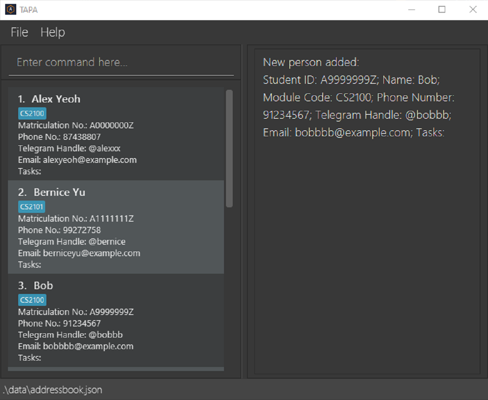

TAPA (Teaching Assistant Personal Assistant) is a desktop app that allows TAs to better manage their student’s progress, 
especially for those 
who are teaching multiple classes/modules at the same time. It is optimised for use on a CLI.

* Table of Contents
{:toc}

--------------------------------------------------------------------------------------------------------------------

## Quick start

1. Ensure you have [Java `11`](https://www.oracle.com/java/technologies/downloads/#java11) or above installed in your Computer.

1. Download the latest `TAPA.jar` from [here](https://github.com/AY2122S2-CS2103T-W09-4/tp/releases).

1. Copy the file to the folder you want to use as the _home folder_ for your AddressBook.

1. Double-click the file to start the app. The GUI similar to the below should appear in a few seconds. Note how the app contains some sample data. 
   

1. Type the command in the command box and press Enter to execute it. e.g. typing **`help`** and pressing Enter will open the help window. 
   Some example commands you can try:

   * **`list`** : Lists all contacts.

   * **`add`**`i/A0123456Z n/john m/CS2103T p/98765432 t/@john e/E0123456Z` : Adds a contact named `John` to TAPA.

   * **`delete`**`3` : Deletes the 3rd entry in TAPA.

   * **`clear`** : Deletes all contacts.

   * **`exit`** : Exits the app.

1. Refer to the [Features](#features) below for details of each command.

--------------------------------------------------------------------------------------------------------------------

## Features

**:information_source: Notes about the command format:** 

* Words in `UPPER_CASE` are the parameters to be supplied by the user. 
  e.g. in `add n/NAME`, `NAME` is a parameter which can be used as `add n/John Doe`.

* Items in square brackets are optional. 
  e.g `n/NAME [t/TAG]` can be used as `n/John Doe t/friend` or as `n/John Doe`.

* Items with `…`​ after them can be used multiple times including zero times. 
  e.g. `[t/TAG]…​` can be used as ` ` (i.e. 0 times), `t/friend`, `t/friend t/family` etc.

* Parameters can be in any order. 
  e.g. if the command specifies `n/NAME p/PHONE_NUMBER`, `p/PHONE_NUMBER n/NAME` is also acceptable.

* If a parameter is expected only once in the command but you specified it multiple times, only the last occurrence of the parameter will be taken. 
  e.g. if you specify `p/12341234 p/56785678`, only `p/56785678` will be taken.

* Extraneous parameters for commands that do not take in parameters (such as `help`, `list`, `exit` and `clear`) will be ignored. 
  e.g. if the command specifies `help 123`, it will be interpreted as `help`.

### Adding a person: `add`

Adds a person to TAPA.

Format: `add i/STUDENT_ID n/STUDENT_NAME m/MODULE_CODE [p/PHONE_NUMBER] [h/TELEGRAM_HANDLE] [e/EMAIL_ADDRESS]​`

* The student’s matriculation number, name as well as module code are compulsory fields.
* The phone number, telegram handle, and email address fields are optional and can be excluded.

Example:
* `add i/A0123456Z n/john m/CS2103T p/98765432 t/@john e/E0123456Z`
    * A student named John is added to TAPA.

### Deleting a student: `delete`

Deletes a student from TAPA.

Format: `delete STUDENT_INDEX`

* The student whose index in the address book is specified after the `delete` command will be removed from the address book.

Example:
* `delete 10`
    * A student named John (whose list index is “10”) is deleted from TAPA.
    * An error message will be displayed to the user if the specified index is a negative number or larger than the number of students in TAPA.

### Finding a student: `find`

Allows the user to look up the details of a particular student.

Format: `find n/[NAME] (or) find i/[STUDENT_ID]`

* The student whose name or student id is specified after the `find` command will appear in the list.

Example:
* `find n/John`
    * Displays the particulars of the students whose names include John.
    * If no name matches John, then the user will be given a message saying no student found under this name.
* `find i/AXXXXXXXR`
    * Displays the particulars of the student with student ID AXXXXXXXR.
    * If the student ID is of the wrong format (incorrect number of characters, or starts with a number, ends with a number), an error will be displayed.
    * If no student is found with the student ID, then a message saying no student found will be displayed.

### Checking all the tasks that a particular student have: `task`

Displays all the tasks that are allocated to a particular student.

Format: `task i/STUDENT_ID`

* The completed and uncompleted tasks are separated into 2 different sections.

Example:
* `task A0123456Z`
    * Lists out the tasks that student (A0123456Z) has.
    
### Archiving details in the address book: `archive`

Saves a copy of the details currently saved in the address book into a separate file.

Format: `archive`

* A copy of the details currently saved in the address book will be saved to a separate file.
* The file name will be the date and time of the archive operation.

### Exiting the program : `exit`

Exits the program.

Format: `exit`

--------------------------------------------------------------------------------------------------------------------

## FAQ

**Q**: What command can I use to view a list of available commands? 
**A**: Use the command “help” to view the list of commands used within TAPA. Alternatively, refer to the Command Summary section below.

--------------------------------------------------------------------------------------------------------------------

## Command summary

Action      | Format, Examples
------------|------------------
**Add**     | `add i/MATRICULATION_NO n/STUDENT_NAME m/MODULE_CODE [p/PHONE_NUMBER] [t/TELEGRAM_HANDLE] [e/EMAIL_ADDRESS] `   e.g., `add i/A0123456Z n/john m/CS2103T p/98765432 t/@john e/E0123456Z`
**Delete**    | `delete STUDENT_INDEX`   e.g., `delete 10`
**Find**    | `find n/NAME` (or) `find i/STUDENT_ID`   e.g., `find n/john`, `find i/A0123456Z`
**Exit**    | `exit`
**Task**    | `task i/STUDENT_ID`   e.g., `task A0123456Z`
**Archive** | `archive`

